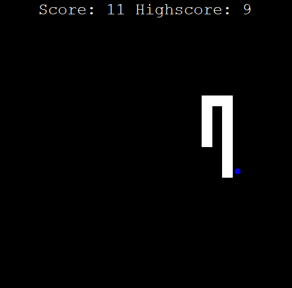

# Traditional Snake Game

Try to beat the highscore in the World-wide known Snake 🐍. Project implemented using Python Object-Oriented programming,
including inheritance. Project completely based on Turtle Graphic module for Python. 
Game developed completely for training purposes 💪.

Enjoy! 🐍
